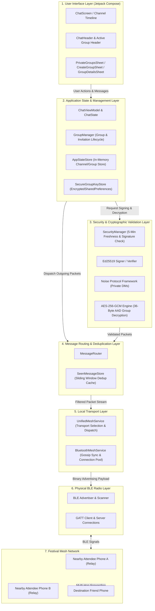
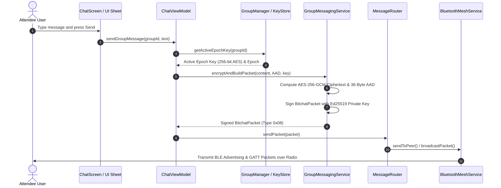
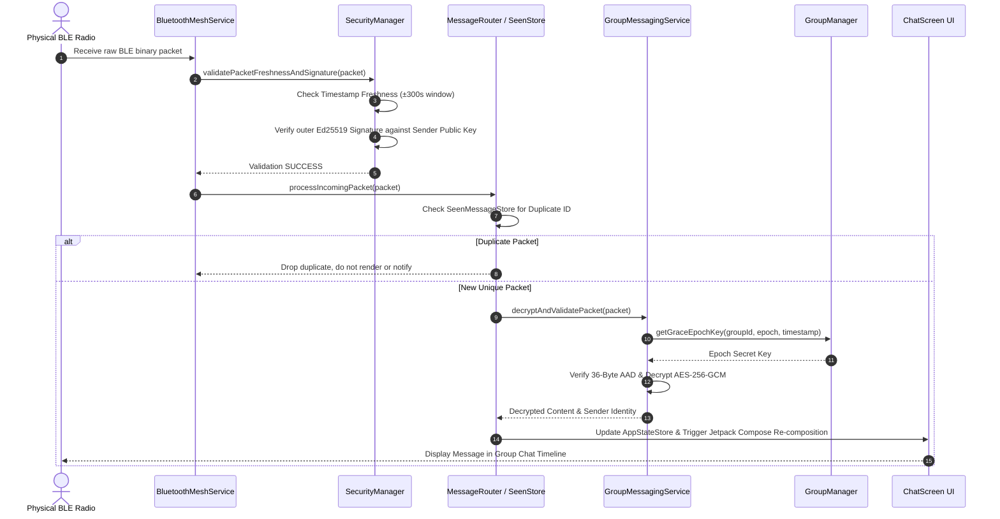

# Campus Festival Mesh Chat

Campus Festival Mesh Chat is an offline, Bluetooth Low Energy (BLE) messaging application built specifically for communication during crowded campus events, concerts, and festivals. Designed for offline BLE mesh communication during crowded campus events, it allows nearby attendees to discover one another and send secure messages without requiring cellular data, Internet connectivity, user accounts, phone numbers, or central servers.

---

## The Problem

At large campus festivals, sports events, and multi-stage concerts, tens of thousands of attendees gather in a concentrated area. This massive influx of devices creates severe cellular network congestion:
- Cell towers become overloaded, causing text messages and data packets to fail or stall indefinitely.
- Attendees lose contact with friends, struggle to coordinate meetups, or cannot reach organizers during emergencies.
- Traditional messaging applications rely completely on centralized cloud servers and active Internet connections, making them useless when networks go down.

---

## The Solution

Campus Festival Mesh Chat addresses network congestion by removing reliance on central cell towers and Internet infrastructure entirely:
- **Direct Peer-to-Peer Communication**: Smartphones communicate directly with neighboring smartphones via Bluetooth Low Energy (BLE).
- **Multi-Hop Mesh Relaying**: Devices automatically relay encrypted messages through intermediate attendee phones, expanding communication range across the festival grounds.
- **100% Offline Operation**: Everything runs locally on device—no SIM card active data, Wi-Fi networks, or cloud backend servers are ever required.
- **Zero-Trust Security**: Messages are authenticated using Ed25519 signatures and encrypted end-to-end using standard cryptographic protocols.

---

## Key Features

| Feature | Description |
|---|---|
| BLE Mesh Messaging | Offline communication using Bluetooth Low Energy |
| Fixed Festival Channels | General, Main Stage, Food Court, Lost & Found, Medical |
| Nickname Onboarding | Simple nickname-based entry without accounts or phone numbers |
| Organizer Broadcasts | Authenticated official announcements with badge verification |
| Emergency SOS | High-priority emergency alerts with cancellation & deduplication |
| Private Friend Groups | Encrypted private group communication with epoch key rotation |
| Replay Protection | Timestamp freshness window (5 min) and duplicate packet suppression |
| Secure Identity | Ed25519-based sender authentication and 8-byte peer ID derivation |
| End-to-End Protection | Noise-based private DMs and AES-256-GCM authenticated group encryption |
| English UI | Simple, intuitive English-only user experience |
| No GPS Tracking | Absolute privacy protection with zero location or GPS tracking |

---

## System Architecture

### Visual Data & Control Flow Diagram



---

## Interactive Step-by-Step Message Lifecycles

### Outgoing Message Flow (Sender Side)



### Incoming Message Flow (Receiver Side)



---

## Architectural Layer Descriptions

1. **User Interface Layer**: Built entirely in Kotlin/Compose. Renders interactive timelines, bottom sheet dialogs (`PrivateGroupsSheet`, `CreateGroupSheet`, `InviteFriendsSheet`, `GroupDetailsSheet`), and active emergency SOS banners. It delegates all operations to `ChatViewModel` and never handles raw crypto keys.
2. **State & Group Management Layer**: `GroupManager` maintains group structures, admin privileges, invitation states, and membership changes. `SecureGroupKeyStore` manages Android `EncryptedSharedPreferences` for epoch key persistence. `AppStateStore` retains active message timelines.
3. **Security & Cryptographic Validation Layer**: `SecurityManager` enforces zero-trust validation on every packet. Verifies Ed25519 signatures, checks timestamp freshness within 5 minutes, and executes AES-256-GCM authenticated decryption using deterministic AAD (`groupId + epoch + senderID + timestamp`).
4. **Message Routing & Deduplication Layer**: `MessageRouter` prevents network loops using `SeenMessageStore` sliding-window deduplication. Handles local delivery vs. multi-hop forwarding logic.
5. **Transport Dispatch Layer**: `UnifiedMeshService` directs traffic to local mesh services and coordinates background/foreground service states.
6. **Bluetooth Mesh Layer**: `BluetoothMeshService` manages GATT client/server connections, gossip synchronization, and BLE packet broadcasting across physical Android radios.
7. **Physical Radio & Mesh Network**: Uses BLE hardware advertising and scanning to form dynamic local mesh networks. Attendee devices automatically forward encrypted packets to extend signal range across festival grounds.

---

## Cryptographic Security Architecture

### 1. Identity & Public Key Infrastructure
- **KeyPair Generation**: On initial setup, each client generates an Ed25519 signing keypair saved securely in Android `EncryptedSharedPreferences` backed by `MasterKey.AES256_GCM`.
- **Peer ID Derivation**: A client's 8-byte Peer ID is derived deterministically from the first 8 bytes of its Ed25519 public signing key (`hexEncodedString()`).
- **Outer Signature**: All binary packets (`BitchatPacket`) carry an outer 64-byte Ed25519 signature computed over the packet contents (version, type, senderID, recipientID, timestamp, and payload).

### 2. Encryption Schemes
- **Private 1-on-1 Messages**: Uses the Noise Protocol Framework (`Noise_XX_25519_ChaChaPoly_BLAKE2b`), establishing mutual authentication and perfect forward secrecy.
- **Private Friend Groups (AES-256-GCM)**: Group messages are encrypted using 256-bit AES-GCM with a cryptographically random 12-byte IV per message.
- **36-Byte Associated Authenticated Data (AAD)**: To prevent group ID, sender ID, epoch, or timestamp tampering, AES-GCM incorporates a mandatory 36-byte AAD:
  ```text
  groupId (16 bytes) | epoch (4 bytes BE) | senderID (8 bytes) | timestamp (8 bytes BE)
  ```
  If any AAD field is altered, GCM tag verification fails closed and the message is discarded.

### 3. Group Lifecycle & Epoch Key Rotation
- **Group Creation**: Generates a random 16-byte Group ID (`grp_<32 hex chars>`) and initializes Epoch 1 key in `SecureGroupKeyStore`.
- **Invitations & Acceptance**: Group admins invite nearby friends by sending an `INVITE` control payload containing the group key encrypted over pairwise Noise channels. Recipients respond with a signed `GROUP_ACCEPT` payload containing their public signing key.
- **Epoch Key Rotation**: When a group member is removed or leaves:
  1. The active epoch is incremented (`epoch + 1`).
  2. A fresh 256-bit AES key is generated for the new epoch.
  3. The new epoch key is distributed exclusively to remaining active members via pairwise Noise channels.
- **2-Minute Key Grace Period**: To prevent message loss caused by BLE network propagation delays, the key from the previous epoch is retained for up to 2 minutes to decrypt packets created *before* the rotation timestamp. Packets created *after* the rotation timestamp strictly require the new epoch key.

---

## Festival Operation Modes

### 1. Fixed Festival Channels
Five pre-configured channels allow attendees to find relevant information quickly:
- `#General`: Main campus-wide discussion feed.
- `#Main Stage`: Performance updates, band schedules, and stage announcements.
- `#Food Court`: Food line updates, vendor options, and seating availability.
- `#Lost & Found`: Item recovery and lost belongings coordination.
- `#Medical`: First aid locations and minor medical inquiries.

### 2. Authenticated Organizer Broadcasts
- Event staff can broadcast official announcements containing a verified **[Official]** badge.
- Protected by local passcode authentication and Ed25519 signature verification to prevent unauthorized broadcast spoofing.

### 3. Emergency SOS Alerts
- Attendees can trigger high-priority SOS emergency broadcasts in urgent situations.
- Highlights an emergency alert banner across nearby devices with location notes (e.g., "Near Main Stage Sound Booth").
- Includes cancellation payload handling and deduplication to prevent notification storms.

### 4. Private Friend Groups
- Small offline private groups for festival groups of friends (up to 30 characters group name, optional local passcode lock).
- Fully encrypted via AES-256-GCM with automatic epoch key rotation on member changes.

---

## Development & Build Instructions

### Prerequisites
- **JDK 21**
- **Android SDK (API 26+ / Android 8.0+)**
- **Android Studio Jellyfish or newer**

### Building Debug APK

```bash
./gradlew clean assembleDebug
```

Output APK location: `app/build/outputs/apk/debug/app-debug.apk`

### Running Unit & Security Test Suites

```bash
# Run all unit tests
./gradlew testDebugUnitTest

# Run dedicated group, SOS, and stress security test suites
./gradlew :app:testDebugUnitTest --tests "com.bitchat.android.group.*" --tests "com.bitchat.android.sos.*" --tests "com.bitchat.android.stress.*"
```

### Running Static Code Analysis (Lint)

```bash
./gradlew lintDebug
```

---

## License

This repository is maintained as an independent open-source project for offline campus mesh networking research and event communications.
